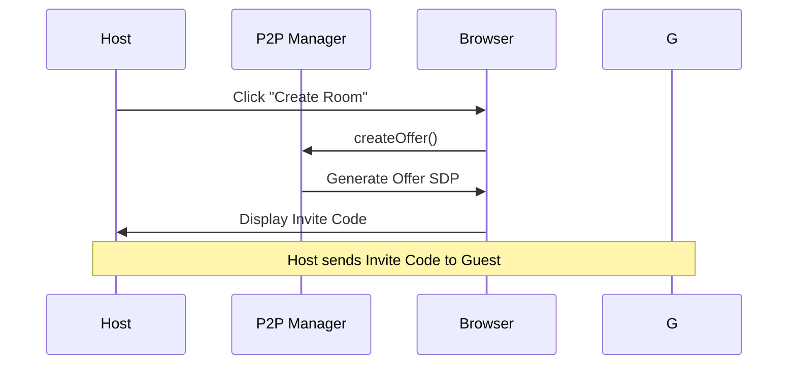
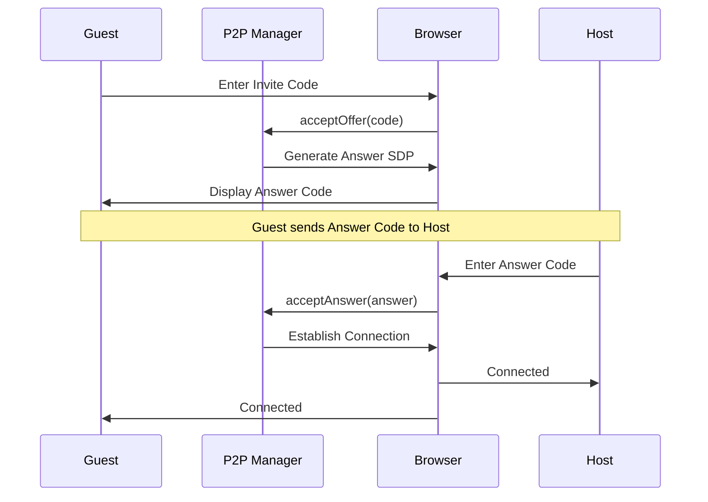
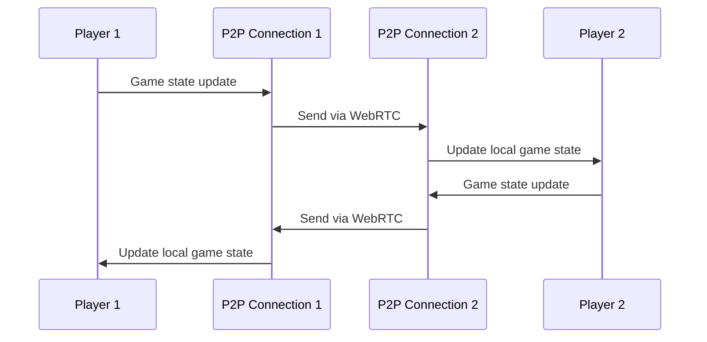
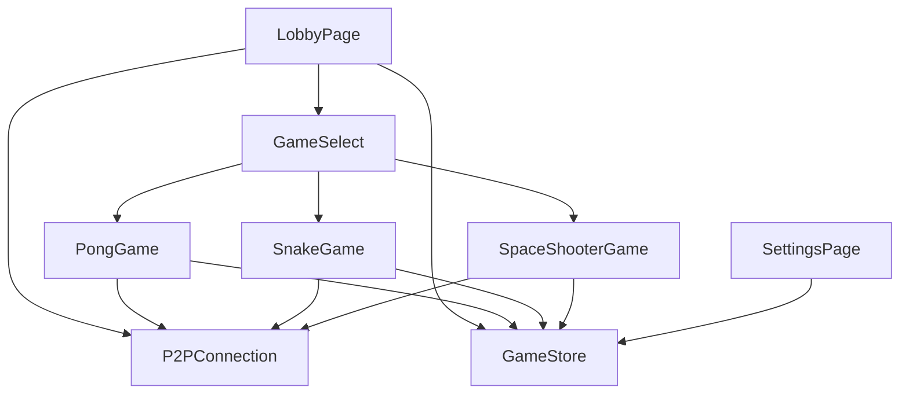
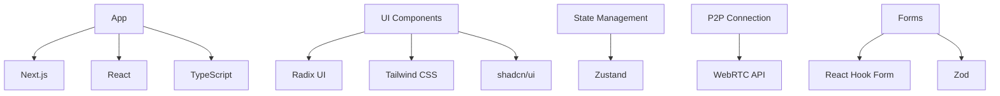

graph TD
    subgraph "Player 1"
        A1[Browser] --> B1[React App]
        B1 --> C1[Game Components]
        B1 --> D1[P2P Connection]
    end
    
    subgraph "Player 2"
        A2[Browser] --> B2[React App]
        B2 --> C2[Game Components]
        B2 --> D2[P2P Connection]
    end
    
    D1 <--> D2[WebRTC P2P Connection]
```

## โครงสร้างไดเรกทอรีและโมดูล

```
/
├── app/                    # Next.js App Router
│   ├── globals.css        # Global styles
│   ├── layout.tsx         # Root layout component
│   ├── page.tsx           # Home page component
│   └── settings/          # Settings page
├── components/            # React components
│   ├── ui/               # Reusable UI components (shadcn/ui)
│   │   ├── button.tsx    # Button component
│   │   ├── card.tsx      # Card component
│   │   ├── input.tsx     # Input component
│   │   └── ...           # Other UI components
│   ├── games/            # Game-specific components
│   │   ├── pong-game.tsx # Pong game implementation
│   │   ├── snake-game.tsx # Snake game implementation
│   │   └── space-shooter-game.tsx # Space shooter implementation
│   ├── game-select.tsx   # Game selection screen
│   ├── lobby-page.tsx    # Main lobby screen
│   ├── settings-page.tsx # Settings page component
│   └── theme-provider.tsx # Theme context provider
├── lib/                   # Utility libraries
│   ├── p2p-connection.ts # WebRTC P2P connection manager
│   ├── game-store.ts     # Zustand state management
│   └── utils.ts          # Utility functions
├── hooks/                 # Custom React hooks
├── public/               # Static assets
└── styles/               # Additional styles
```

## โมดูลหลักและความรับผิดชอบ

### 1. P2P Connection Manager (`lib/p2p-connection.ts`)

**ความรับผิดชอบ:**
- จัดการการเชื่อมต่อ WebRTC แบบ peer-to-peer
- สร้างและจัดการ Offer/Answer SDP
- จัดการ ICE candidates
- จัดการสถานะการเชื่อมต่อ
- ส่งและรับข้อมูลระหว่างผู้เล่น

**Dependencies:**
- WebRTC API (RTCPeerConnection, RTCDataChannel)
- Browser crypto API (สำหรับ encoding/decoding)

**Interface:**
```typescript
class P2PConnection {
  onStatusChange(callback: (status: ConnectionStatus) => void): void
  onMessage(callback: (message: PeerMessage) => void): void
  createOffer(): Promise<string>
  acceptOffer(offerString: string): Promise<string>
  acceptAnswer(answerString: string): Promise<void>
  send(type: string, data: any): void
  disconnect(): void
}
```

### 2. Game Store (`lib/game-store.ts`)

**ความรับผิดชอบ:**
- จัดการสถานะทั่วไปของแอปพลิเคชัน
- เก็บข้อมูลผู้เล่นและคู่แข่ง
- เก็บข้อมูลเกมปัจจุบัน
- จัดการการตั้งค่าของผู้ใช้

**Dependencies:**
- Zustand (state management)

**Interface:**
```typescript
interface GameStore {
  isHost: boolean
  player: Player
  opponent: Player | null
  currentGame: GameType
  settings: {
    playerName: string
    soundEnabled: boolean
  }
  // Actions
  setIsHost: (isHost: boolean) => void
  setPlayer: (player: Player) => void
  setOpponent: (opponent: Player | null) => void
  setCurrentGame: (game: GameType) => void
  updateSettings: (settings: Partial<Settings>) => void
}
```

### 3. Game Components (`components/games/`)

**ความรับผิดชอบ:**
- แสดงภาพเกมและจัดการ game loop
- จัดการการโต้ตอบกับผู้เล่น
- ส่งข้อมูลเกมไปยังผู้เล่นอีกฝ่าย
- คำนวณคะแนนและสถานะเกม

**Dependencies:**
- P2P Connection
- Game Store
- React hooks (useState, useEffect, useRef)

**Interface:**
```typescript
interface GameProps {
  connection: P2PConnection | null
  isSinglePlayer?: boolean
  onBack?: () => void
}
```

### 4. Lobby Page (`components/lobby-page.tsx`)

**ความรับผิดชอบ:**
- จัดการการสร้างและเข้าร่วมห้อง
- แสดงสถานะการเชื่อมต่อ
- จัดการรหัสเชิญ
- ส่งผู้เล่นไปยังหน้าเลือกเกม

**Dependencies:**
- P2P Connection
- Game Store
- React hooks

## การไหลของข้อมูล (Data Flow)

### การสร้างห้องเกม


### การเข้าร่วมห้องเกม


### การเล่นเกม


## การพึ่งพาระหว่างส่วนต่างๆ (Dependencies)

### React Component Dependencies


### External Dependencies


## การ Build และ Run

### การติดตั้ง Dependencies
```bash
npm install
# หรือ
pnpm install
```

### การรันใน Development Mode
```bash
npm run dev
# หรือ
pnpm dev
```

### การ Build สำหรับ Production
```bash
npm run build
# หรือ
pnpm build
```

### การรัน Production Build
```bash
npm run start
# หรือ
pnpm start
```

### การตรวจสอบโค้ดด้วย ESLint
```bash
npm run lint
# หรือ
pnpm lint
```

## การ Deploy

### Vercel (แนะนำ)
1. Push code ไปยัง GitHub repository
2. Connect repository กับ Vercel
3. Vercel จะทำการ build และ deploy อัตโนมัติ

### การ Deploy ด้วย Docker
```dockerfile
FROM node:18-alpine

WORKDIR /app

COPY package*.json ./
RUN npm ci --only=production

COPY . .
RUN npm run build

EXPOSE 3000

CMD ["npm", "start"]
```

## ประสิทธิภาพและการปรับให้เหมาะสม

### การจัดการ State
- ใช้ Zustand สำหรับ global state เพื่อลดการ re-render
- เก็บ state ใกล้ที่ที่ใช้มากที่สุด (local state)
- ใช้ `useMemo` และ `useCallback` เพื่อลดการคำนวณซ้ำ

### การเพิ่มประสิทธิภาพการเล่นเกม
- ใช้ `requestAnimationFrame` สำหรับ game loop
- ลดการส่งข้อมูลผ่าน P2P connection โดยใช้ delta compression
- ใช้ Canvas API สำหรับ rendering เกมที่ต้องการประสิทธิภาพสูง

### การจัดการ Memory
- ทำ cleanup เมื่อ component unmount
- หยุด game loop เมื่อไม่ได้ใช้งาน
- ปิด P2P connection เมื่อออกจากเกม

## การจัดการ Error และ Edge Cases

### การเชื่อมต่อ P2P ล้มเหลว
- แสดงข้อความแจ้งเตือน
- ให้ผู้ใช้ลองใหม่
- แนะนำให้ลองใช้ browser อื่นหากจำเป็น

### Browser ไม่รองรับ WebRTC
- ตรวจสอบความสามารถของ browser ตอนเริ่มต้น
- แสดงข้อความแจ้งเตือนหากไม่รองรับ
- แนะนำให้ใช้ browser ที่รองรับ

### การเชื่อมต่อขาดหายระหว่างเกม
- พยายามเชื่อมต่อใหม่อัตโนมัติ
- หยุดเกมชั่วคราว
- แสดงสถานะการเชื่อมต่อให้ผู้ใช้ทราบ

## Definition of Done (DoD)

- ✅ อธิบายโครงสร้างระบบและโมดูลต่างๆ อย่างครบถ้วน
- ✅ มี diagrams ที่อธิบายการไหลของข้อมูลและการพึ่งพาระหว่างส่วนต่างๆ
- ✅ ระบุ dependencies ทั้งภายในและภายนอก
- ✅ มีข้อมูลเกี่ยวกับการ build, run และ deployment
- ✅ ครอบคลุมด้านประสิทธิภาพและการจัดการ error

## Acceptance Criteria

- ✅ นักพัฒนาสามารถเข้าใจโครงสร้างระบบและความสัมพันธ์ระหว่างส่วนต่างๆ
- ✅ มีข้อมูลเพียงพอสำหรับการวางแผนการพัฒนาและการเพิ่มฟีเจอร์ใหม่
- ✅ ช่วยในการ debug และการบำรุงรักษาระบบ
- ✅ มีแนวทางที่ชัดเจนสำหรับการปรับปรุงประสิทธิภาพและการจัดการ error
- ✅ สามารถนำไปใช้เป็นแนวทางในการ train สมาชิกใหม่ในทีม