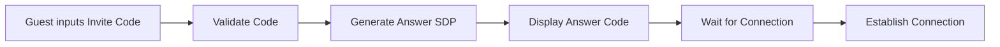
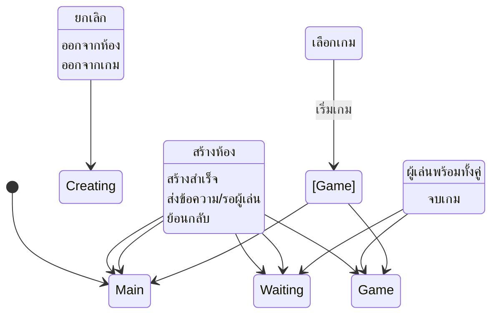
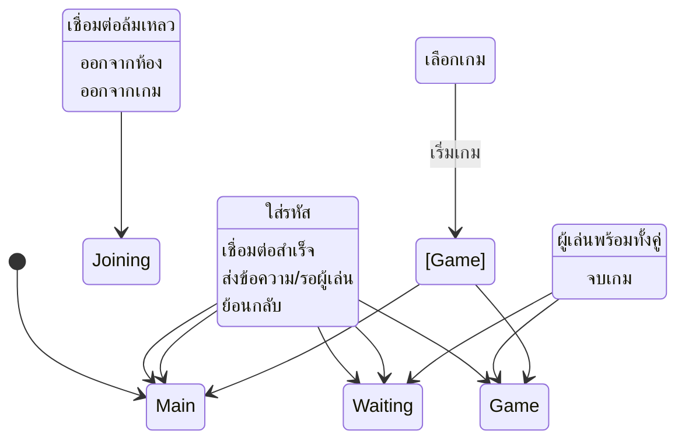

flowchart LR
    A[Host clicks 'Create Room'] --> B[Generate Offer SDP]
    B --> C[Display Invite Code]
    C --> D[Wait for Answer SDP]
    D --> E[Accept Answer]
    E --> F[Establish Connection]
```

**Input:**
- การคลิกปุ่ม "สร้างห้อง"
- รหัสตอบกลับ (Answer SDP) จากผู้เข้าร่วม

**Output:**
- รหัสเชิญ (Invite Code) ในรูปแบบ base64
- สถานะการเชื่อมต่อ
- ข้อความแจ้งเตือนความสำเร็จ/ความล้มเหลว

#### การเข้าร่วมห้อง (Join Room)


**Input:**
- รหัสเชิญ (Invite Code) จากผู้สร้างห้อง
- การคลิกปุ่ม "เข้าร่วม"

**Output:**
- รหัสตอบกลับ (Answer SDP) ในรูปแบบ base64
- สถานะการเชื่อมต่อ
- ข้อความแจ้งเตือนความสำเร็จ/ความล้มเหลว

### โมเดลการจัดการข้อผิดพลาด (Error Model)

| ประเภทข้อผิดพลาด | สาเหตุที่เป็นไปได้ | การแก้ไข | การสื่อสารกับผู้ใช้ |
| --- | --- | --- | --- |
| การเชื่อมต่อล้มเหลว | Network error, WebRTC not supported, firewall | แสดงข้อความแจ้งเตือนและปุ่ม "ลองใหม่" | "การเชื่อมต่อล้มเหลว กรุณาลองใหม่อีกครั้ง" |
| รหัสเชิญไม่ถูกต้อง | รหัสผิด หรือหมดอายุ | แจ้งให้ตรวจสอบรหัสอีกครั้ง | "รหัสไม่ถูกต้อง กรุณาตรวจสอบและลองอีกครั้ง" |
| การเชื่อมต่อขาดหาย | Network interruption | พยายามเชื่อมต่อใหม่อัตโนมัติ 3 ครั้ง | "การเชื่อมต่อขาดหาย กำลังพยายามเชื่อมต่อใหม่..." |
| Browser ไม่รองรับ WebRTC | Browser เก่าเกินไป | แนะนำให้ใช้ browser รุ่นใหม่ | "เบราว์เซอร์ของคุณไม่รองรับ กรุณาอัปเกรดเป็นรุ่นล่าสุด" |

### การไหลของประสบการณ์ผู้ใช้ (UX Flow)

#### โฟลว์การสร้างห้อง


#### โฟลว์การเข้าร่วมห้อง


### ข้อกำหนดที่ไม่ใช่ฟังก์ชัน (Non-Functional Requirements)

| ประเภท | คำอธิบาย |
| --- | --- |
| **ประสิทธิภาพ** | เวลาเชื่อมต่อเริ่มต้นไม่เกิน 5 วินาที ในเครือข่ายปกติ |
| **ความน่าเชื่อถือ** | รองรับการเชื่อมต่อที่ขาดหายไปชั่วคราว พยายามเชื่อมต่อใหม่อัตโนมัติ |
| **ประสิทธิภาพใช้งาน** | UI ตอบสนองภายใน 100ms สำหรับ interaction ที่สำคัญ |
| **ความเข้ากันได้** | รองรับ Chrome 90+, Firefox 88+, Safari 14+ |
| **ความปลอดภัย** | ใช้ WebRTC secure connection ไม่เก็บข้อมูลส่วนตัวผู้ใช้ |
| **ปรับขนาดได้** | ไม่มีข้อจำกัดในการเชื่อมต่อ เนื่องจากใช้ P2P |

## ฟีเจอร์: เกม Pong แบบ Co-op

### ภาพรวม
เกม Pong แบบพื้นฐานที่ปรับเปลี่ยนให้ผู้เล่นสองคนร่วมมือกันเพื่อรักษาบอลไว้ในสนามให้นานที่สุด มีการควบคุมแยกกันสำหรับแต่ละผู้เล่น

### ข้อมูลเข้า/ออก (Input/Output)

**Input:**
- การกดปุ่มคีย์บอร์ด (W/S สำหรับผู้เล่น 1, ขึ้น/ลง สำหรับผู้เล่น 2)
- การสัมผัสบนหน้าจอ (สำหรับอุปกรณ์มือถือ)
- ข้อมูลตำแหน่งแพดเดิลจากผู้เล่นอีกฝ่ายผ่าน P2P connection

**Output:**
- ภาพเกม 60 FPS
- คะแนนปัจจุบัน
- ข้อความแจ้งสถานะเกม
- เสียงเอฟเฟกต์ (ถ้าเปิดใช้งาน)

### กฎเกมและกลไก
- แต่ละผู้เล่นควบคุมแพดเดิลที่อยู่ด้านตรงข้ามกัน
- บอลเด้งกลับเมื่อชนแพดเดิลหรือขอบสนามบน/ล่าง
- คะแนนเพิ่มขึ้นเมื่อบอลโดนแพดเดิล
- เกมจบเมื่อบอลออกจากขอบสนามซ้ายหรือขวา
- ความเร็วบอลเพิ่มขึ้นทุกครั้งที่โดนแพดเดิล

## ฟีเจอร์: เกม Snake แบบ Co-op

### ภาพรวม
เกมงูแบบพื้นฐานที่ผู้เล่นสองคนควบคุมงูสองตัวแยกกันแต่อยู่ในสนามเดียวกัน ต้องเก็บอาหารและหลีกเลี่ยงการชนกันและขอบสนาม

### ข้อมูลเข้า/ออก (Input/Output)

**Input:**
- การกดปุ่มคีย์บอร์ด (WASD สำหรับผู้เล่น 1, ลูกศร สำหรับผู้เล่น 2)
- การสัมผัสบนหน้าจอ (สำหรับอุปกรณ์มือถือ)
- ข้อมูลตำแหน่งงูจากผู้เล่นอีกฝ่ายผ่าน P2P connection

**Output:**
- ภาพเกม 30-60 FPS
- คะแนนปัจจุบันของแต่ละผู้เล่น
- ข้อความแจ้งสถานะเกม
- เสียงเอฟเฟกต์ (ถ้าเปิดใช้งาน)

### กฎเกมและกลไก
- ผู้เล่น 1 ควบคุมงูสีเขียว ผู้เล่น 2 ควบคุมงูสีแดง
- งูเคลื่อนที่ไปข้างหน้าตลอดเวลา
- งูเติบโตขึ้นเมื่อกินอาหาร
- เกมจบเมื่องูชนขอบสนาม ตัวเอง หรืองูอีกตัว
- คะแนนเพิ่มขึ้นตามจำนวนอาหารที่กิน

## ฟีเจอร์: เกม Space Shooter แบบ Co-op

### ภาพรวม
เกมยิงยานอวกาศแบบพื้นฐานที่ผู้เล่นสองคนร่วมกันยิงศัตรู มีระบบคะแนนและ power-up พื้นฐาน

### ข้อมูลเข้า/ออก (Input/Output)

**Input:**
- การกดปุ่มคีย์บอร์ด (WASD สำหรับเคลื่อนที่, Space สำหรับยิง - ผู้เล่น 1)
- การกดปุ่มคีย์บอร์ด (ลูกศร สำหรับเคลื่อนที่, Enter สำหรับยิง - ผู้เล่น 2)
- การสัมผัสบนหน้าจอ (สำหรับอุปกรณ์มือถือ)
- ข้อมูลตำแหน่งยานและกระสุนจากผู้เล่นอีกฝ่ายผ่าน P2P connection

**Output:**
- ภาพเกม 30-60 FPS
- คะแนนปัจจุบันของแต่ละผู้เล่น
- ข้อความแจ้งสถานะเกม
- เสียงเอฟเฟกต์ (ถ้าเปิดใช้งาน)

### กฎเกมและกลไก
- ผู้เล่น 1 ควบคุมยานสีฟ้า ผู้เล่น 2 ควบคุมยานสีม่วง
- ศัตรูปรากฏจากด้านบนของหน้าจอ
- คะแนนเพิ่มเมื่อยิงศัตรูได้
- เกมจบเมื่อยานถูกยิง
- มี power-up บางอย่างเช่น ชีวิตเพิ่ม, ยิงได้พร้อมกันหลายนัด

## ปัญหาระดับสูงที่ต้องแก้ไขโดยเร่งด่วน (Critical Issues Requiring Immediate Attention)

### 1. ระบบ P2P ไม่สามารถใช้งานได้ (P2P System Non-functional)
**ปัญหา:** ระบบเชื่อมต่อ P2P ปัจจุบันใช้งานไม่ได้ในสถานการณ์จริง

**สาเหตุที่เป็นไปได้:**
- การจัดการ ICE candidates ไม่ถูกต้อง
- การตั้งค่า WebRTC ไม่เหมาะสมกับสภาพแวดล้อมต่างๆ
- ข้อผิดพลาดในการส่งข้อมูลระหว่าง peers
- ปัญหา NAT traversal ในหลายเครือข่าย

**ผลกระทบต่อสเปค:**
- ข้อกำหนด I/O สำหรับการสร้างและเข้าร่วมห้องใช้งานไม่ได้
- การส่งข้อมูลเกมระหว่างผู้เล่นไม่สามารถทำได้
- ฟีเจอร์หลักของโปรเจกต์ใช้งานไม่ได้

**วิธีแก้ไขในระดับสเปค:**
- แก้ไขขั้นตอนการสร้างและจัดการ ICE candidates
- ปรับปรุงขั้นตอนการเชื่อมต่อเพื่อให้ทนทานต่อสถานการณ์เครือข่ายต่างๆ
- เพิ่มขั้นตอน fallback เมื่อการเชื่อมต่อล้มเหลว

### 2. UI ไม่เหมาะสมกับอุปกรณ์มือถือ (Mobile UI Incompatibility)
**ปัญหา:** UI ปัจจุบันไม่เหมาะสมกับการใช้งานบนอุปกรณ์มือถือ

**สาเหตุที่เป็นไปได้:**
- ขนาด UI elements ไม่เหมาะกับหน้าจอเล็ก
- การควบคุมเกมออกแบบมาสำหรับคีย์บอร์ดเท่านั้น
- ไม่มีปุ่ม reset สำหรับอุปกรณ์ทัชสกรีน
- การวาง Layout ไม่รองรับหน้าจอแนวตั้ง

**ผลกระทบต่อสเปค:**
- Input requirements สำหรับเกมไม่ครอบคลุมอุปกรณ์มือถือ
- Output requirements ไม่รองรับหน้าจอขนาดเล็ก
- UX flow ไม่สามารถใช้งานได้บนอุปกรณ์มือถือ

**วิธีแก้ไขในระดับสเปค:**
- เพิ่มข้อกำหนด I/O สำหรับอุปกรณ์มือถือ
- ปรับปรุง UX flow ให้รองรับทั้ง desktop และ mobile
- กำหนด UI elements ที่เหมาะสมสำหรับอุปกรณ์แต่ละประเภท

## Definition of Done (DoD)

- ✅ ระบุสเปคของฟีเจอร์หลักทั้งหมด (P2P connection, เกม)
- ✅ มีข้อกำหนด I/O ที่ชัดเจนสำหรับแต่ละฟีเจอร์
- ✅ มี error model ที่ครอบคลุมกรณีการใช้งานต่างๆ
- ✅ มี UX flow diagrams ที่อธิบายการทำงานของระบบ
- ✅ มี non-functional requirements ที่สำคัญ
- ✅ ระบุปัญหาระดับสูงที่ต้องแก้ไขโดยเร่งด่วน

## Acceptance Criteria

- ✅ นักพัฒนาสามารถนำสเปคไปใช้ในการพัฒนาฟีเจอร์ต่างๆ ได้
- ✅ มีข้อมูลเพียงพอสำหรับการออกแบบและพัฒนา
- ✅ มีข้อกำหนดที่สามารถทดสอบได้จริง
- ✅ ครอบคลุมทั้งด้านฟังก์ชันการทำงานและประสบการณ์ผู้ใช้
- ✅ มีข้อมูลที่ช่วยในการวางแผนและการประเมินความสำเร็จ
- ✅ มีข้อมูลเพียงพอสำหรับการแก้ไขปัญหาระดับสูงที่ต้องเร่งด่วน
- ✅ สามารถนำสเปคที่แก้ไขแล้วไปแก้ไขระบบ P2P และ UI สำหรับมือถือได้ทันที